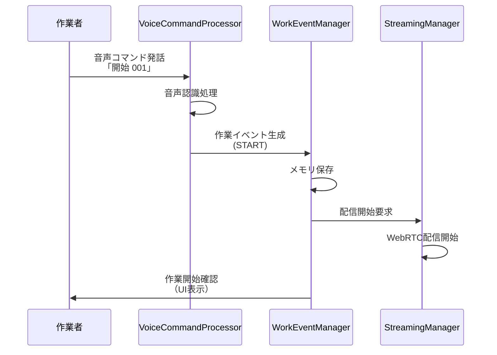
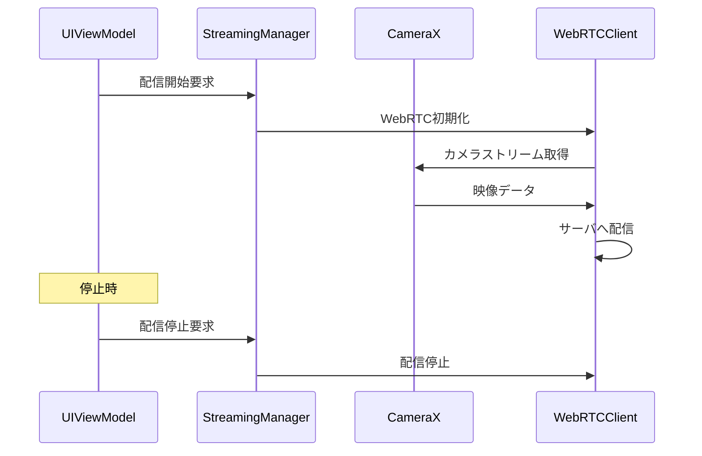

# 装着型デバイス設計書：映像・音声ベース作業分析自動化システム

# 1. 目的
本書は、音声ベース作業分析自動化システムにおける装着型デバイス層の詳細設計を定義する。THINKLETハードウェアの特性を活用し、Kotlin Multiplatformを用いたシンプルなアプリケーションの実装指針を提供することを目的とする。

# 2. 適用範囲
- 対象：THINKLETデバイス上で動作するAndroidアプリケーション
- 対象外：サーバ側システム、他プラットフォーム（iOS/Desktop）の詳細実装

# 3. 要件対応マトリクス

| 要件ID | 要件内容           | 実装方針                         |
| ------ | ------------------ | -------------------------------- |
| F-001  | 端末登録・管理機能 | メモリベース端末識別子管理       |
| F-010  | 低遅延映像配信     | WHIPプロトコルによるWebRTC配信   |
| F-012  | 音声イベント取得   | THINKLET SDK音声認識とサーバ送信 |
| N-001  | 配信遅延1秒以内    | WebRTCストリーミング最適化       |

# 4. システム全体構成

## 4.1. アーキテクチャ概要

```
┌──────────────────────────────────────────────────-───┐
│                THINKLET Device                       │
├───────────────────────────────────────────────────-──┤
│  ┌─────────────────┐  ┌─────────────────────────────┐│
│  │  Presentation   │  │       Platform Layer        ││
│  │     Layer       │  │  ┌───────────┬───────────┐  ││
│  │ ┌─────────────┐ │  │  │  Camera   │   Audio   │  ││
│  │ │ Compose UI  │ │  │  │ (CameraX) │ (SDK-Audio)│ ││
│  │ │   - Status  │ │  │  └───────────┴───────────┘  ││
│  │ │   - Control │ │  │                             ││
│  │ │   - Config  │ │  │                             ││
│  │ └─────────────┘ │  │                             ││
│  └─────────────────┘  └─────────────────────────────┘│
├─────────────────────────────────────────────────--───┤
│  ┌─────────────────┐  ┌─────────────────────────────┐│
│  │   Domain Layer  │  │       Data Layer            ││
│  │ ┌─────────────┐ │  │  ┌───────────┬───────────┐  ││
│  │ │ UseCase     │ │  │  │  Memory   │  Network  │  ││
│  │ │ - Stream    │ │  │  │  Cache    │ (gRPC)    │  ││
│  │ │ - Event     │ │  │  │           │           │  ││
│  │ │ - Sync      │ │  │  │           │           │  ││
│  │ └─────────────┘ │  │  └───────────┴───────────┘  ││
│  └─────────────────┘  └─────────────────────────────┘│
└──────────────────────────────────────────────────────┘
```

## 4.2. Kotlin Multiplatform構成

```
kmp/
├── shared/                          # KMP共通モジュール
│   ├── commonMain/                  # 全プラットフォーム共通
│   │   ├── kotlin/ai/fd/airakuvision/
│   │   │   ├── domain/              # ビジネスロジック
│   │   │   │   ├── model/           # ドメインモデル
│   │   │   │   ├── usecase/         # ユースケース
│   │   │   │   └── repository/      # リポジトリ抽象
│   │   │   ├── data/                # データ層抽象
│   │   │   │   ├── api/             # API抽象
│   │   │   │   └── dto/             # データ転送オブジェクト
│   │   │   └── presentation/        # プレゼンテーション層
│   │   │       ├── viewmodel/       # 共通ViewModel
│   │   │       └── state/           # UI状態管理
│   ├── androidMain/                 # 汎用Android実装
│   │   └── kotlin/ai/fd/airakuvision/
│   │       ├── data/                # データ層実装
│   │       │   └── network/         # HTTP/gRPC実装
│   │       ├── platform/            # Android固有機能
│   │       │   ├── permission/      # 権限管理
│   │       │   ├── notification/    # 通知システム
│   │       │   └── lifecycle/       # ライフサイクル管理
│   │       └── ui/                  # Android UI実装
│   │           └── compose/         # Compose UI
│   └── thinkletMain/                # THINKLET特化実装
│       └── kotlin/ai/fd/airakuvision/
│           ├── hardware/            # THINKLET SDK統合
│           │   ├── audio/           # 音声・マイク制御
│           │   └── camera/          # カメラ制御拡張
│           └── streaming/           # WebRTC/WHIP配信
│               ├── webrtc/          # WebRTC実装
│               └── whip/            # WHIP対応
└── thinkletApp/                     # THINKLETアプリ本体
    ├── build.gradle.kts
    ├── src/main/
    │   ├── kotlin/
    │   │   └── ai/fd/airakuvision/thinklet/
    │   │       ├── ThinkletApplication.kt  # アプリケーションクラス
    │   │       ├── MainActivity.kt         # メインアクティビティ
    │   │       ├── service/               # フォアグラウンドサービス
    │   │       │   ├── StreamingService.kt
    │   │       │   └── VoiceService.kt
    │   │       ├── receiver/              # ブロードキャストレシーバー
    │   │       └── di/                    # 依存性注入
    │   ├── res/                           # Androidリソース
    │   │   ├── layout/
    │   │   ├── values/
    │   │   ├── drawable/
    │   │   └── raw/                       # 音声ファイル等
    │   └── assets/                        # アセットファイル
    └── AndroidManifest.xml
```

# 5. 機能設計

## 5.1. 映像配信機能

### 5.1.1. 配信アーキテクチャ

映像配信機能は以下の主要コンポーネントで構成される：

- **StreamingManager**: カメラ制御とWHIPクライアントを統合し、配信セッションを管理する
- **WHIPClient**: WebRTCシグナリングを処理し、メディアストリームの送信を担当する
- **AudioProcessor**: 音声ストリームの前処理と品質調整を実行する

配信品質の管理として、ビットレート動的調整、フレームレート制御、音声品質最適化を実装する。


## 5.2. 音声認識・イベント処理

### 5.2.1. 音声認識実装

音声認識機能は以下の要素で構成される：

- **VoiceCommandProcessor**: 5チャンネルマイクからの音声入力を処理し、音声認識エンジンと連携する
- **CommandParser**: 認識された音声テキストを解析し、定義済みコマンドパターンとマッチングする
- **RecognitionListener**: 音声認識結果を受け取り、信頼度に応じて処理を分岐する

対応する音声コマンドは以下の形式：
- 開始コマンド: 「開始」
- 終了コマンド: 「終了」
- 中断コマンド: 「中断」
- 再開コマンド: 「再開」

騒音環境下での認識精度向上のため、THINKLETのビームフォーミング機能を活用し、話者方向の音声を強調する。

### 5.2.2. 確認プロンプト機能

音声認識の信頼度が設定閾値（0.7）を下回る場合、確認プロンプト機能が作動する：

- **VoiceConfirmationManager**: 認識結果の信頼度判定と確認フローを管理する
- **TTS Engine**: 日本語音声合成により確認メッセージを出力する
- **Timeout Management**: 確認応答の制限時間（10秒）を管理する

確認フローは以下の手順で実行される：
1. 音声認識結果の信頼度評価
2. 閾値以下の場合、「[認識テキスト]でよろしいですか？」を音声出力
3. 作業者からの「はい」「いいえ」の応答を待機
4. タイムアウトまたは明確な応答により処理を継続・中止

この機能により、騒音環境下での誤認識を効果的に防止する。

## 5.3. 作業イベント管理

### 5.3.1. イベント定義

作業イベントは以下の属性で定義される：

**基本属性**:
- イベントID（UUID）、デバイスID、イベント種別、タイムスタンプ

**音声認識関連**:
- 認識テキスト、信頼度スコア

**管理属性**:
- メタデータ（追加情報のキー・バリューペア）、同期ステータス

**イベント種別**:
- START（開始）、END（終了）、SUSPEND（中断）、RESUME（再開）

**同期ステータス**:
- Pending（同期待機）、InProgress（同期中）、Completed（完了）、Failed（失敗）

### 5.3.2. イベント管理実装

イベント管理機能は以下の処理フローで動作する：

**イベント登録処理**:
1. 順序検証: 作業ステップの整合性を確認
2. イベント生成: デバイス情報とタイムスタンプを自動付与
3. サーバ送信: gRPCで遅延なくサーバに送信

**WorkEventManager**の責務:
- 音声コマンドから作業イベントへの変換
- 順序リストとの照合による妥当性検証
- メモリベースイベント管理
- ネットワーク同期の管理

**エラーハンドリング**:
- 順序不整合時の警告表示
- ネットワーク障害時のメモリ保存継続
- 重複イベントの検出と除外


# 6. データ管理

## 6.1. メモリベースデータ管理

### 6.1.1. データ構造定義

アプリケーションメモリ内で以下のデータ構造で管理される：

**WorkEventModel**:
- イベントID（UUID）、デバイスID、イベント種別、タイムスタンプ
- 認識テキスト、信頼度、同期ステータス

**DeviceConfig**:
- デバイス固有の設定情報（メモリ内管理）

### 6.1.2. データ管理実装

**MemoryEventRepository**の機能:
- メモリ内リストでのイベント一時保存
- サーバ送信完了後の自動削除
- アプリ終了時の未送信データ警告

**データライフサイクル**:
- イベント生成→メモリ保存→サーバ送信→削除
- シンプルなフローで永続化コストを削減
- 全てメモリベースで軽量化

## 6.2. リアルタイム送信

### 6.2.1. 即座送信機能

ネットワーク接続時の即座データ送信：

**DirectSyncManager**の機能:
- イベント生成時の即座gRPC送信
- 送信失敗時のインメモリリトライ（最大3回）
- エラー時のユーザー通知とログ出力

**送信フロー**:
1. イベント生成と同時にサーバ送信
2. 成功時は処理完了
3. 失敗時は短時間リトライ後、エラー通知

**ネットワーク管理**:
- ConnectivityManagerでリアルタイム接続状態監視
- Wi-Fi/セルラー通信の利用可能性チェック

# 7. ネットワーク通信

## 7.1. gRPC実装

### 7.1.1. API定義

サーバとの通信はProtocol Buffersを使用したgRPCで実装される：

**WorkEventService**:
- RegisterEvent: 作業イベントの登録
- GetDeviceStatus: デバイス現在状態の取得
- ValidateSequence: 月連番と順序リストの照合

**メッセージ定義**:
- RegisterEventRequest: デバイスID、イベント種別、月連番、タイムスタンプ、認識テキスト、信頼度、メタデータ
- EventType列挙: START、END、SUSPEND、RESUME

### 7.1.2. クライアント実装

gRPCクライアントは以下の機能を提供する：

**GrpcWorkEventClient**:
- ManagedChannelを使用した持続的接続管理
- コルーチンスタブによる非同期通信
- イベントデータのProtocol Buffers変換
- エラーハンドリングとResult型での結果返却

**接続管理**:
- TLS暗号化通信の設定
- タイムアウト設定とリトライロジック
- 接続プールの再利用とリソース管理

## 7.2. WebRTC実装

### 7.2.1. WHIP配信

WebRTCを使用した低遅延映像配信の実装：

**WHIPStreamingClient**の機能:
- PeerConnectionの初期化と設定管理
- STUNサーバーとICEサーバーの設定
- メディアストリームのアタッチと管理

**シグナリング処理**:
- SDP Offerの作成とWHIPエンドポイントへの送信
- ICE候補の収集とシグナリングサーバーへの送信
- リモート側からのSDP Answerの処理

**接続状態管理**:
- PeerConnectionStateの監視とイベント処理
- 接続失敗時の自動再接続機能
- ネットワーク品質の監視とアダプティブビットレート制御

**メディア品質管理**:
- 解像度、フレームレート、ビットレートの動的調整
- ネットワーク帯域に応じた品質最適化
- 音声コーデックの選択と設定

# 8. UI設計

## 8.1. Compose UI実装

### 8.1.1. メイン画面

THINKLET用のUIはシンプルで直感的なデザインとする：

**メイン画面の構成**:
- ステータスカード: デバイス、配信状態の表示
- 作業情報カード: 現在の月連番、工程、開始時刻の表示
- 制御ボタン: 配信の手動制御
- 音声認識カード: リスニング状態、最終認識テキスト、信頼度の表示

**デザイン原則**:
- 大きなフォントサイズで読みやすさを確保
- 高コントラスト配色で現場環境での視認性を向上
- シンプルなレイアウトで操作を簡素化
- 状態変化の視覚的フィードバックを充実

### 8.1.2. ステータス表示コンポーネント

システム状態の一覧表示機能：

**StatusCard**コンポーネント:
- Material3デザインシステムに準拠
- 配信状態の表示
- 状態に応じた色分け（正常、エラー、警告）

**StatusItem**コンポーネント:
- ラベルと状態値のセット表示
- 動的な色変更機能
- アクセシビリティ対応のテキストサイズ

## 8.2. ViewModel実装

MVVMアーキテクチャによるUI状態管理：

**ThinkletMainViewModel**の機能:
- システム状態のStateFlowでの管理
- UIイベントの処理とビジネスロジックへの連携
- 非同期処理のCoroutineScope管理
- システム状態のリアルタイム監視

**主要な機能**:
- 配信開始・停止の制御
- 音声認識状態の管理

**UI状態管理**:
- ThinkletUiStateデータクラスでの状態統合
- デバイス状態、配信状態の管理
- 現在の作業情報（月連番、工程、開始時刻）
- 音声認識状態（リスニング、最終認識テキスト、信頼度）

**状態監視**:
- Flowを使用したリアクティブな状態更新
- ViewModelScopeでのライフサイクル管理
- エラーハンドリングとユーザーフィードバック

# 9. パフォーマンス管理

## 9.1. メモリ管理

安定したメモリ使用のための管理機能：

**MemoryManager**の機能:
- LruCacheを使用したメモリキャッシュ管理（最大メモリの1/8を使用）
- 不要キャッシュの定期的クリア
- ガベージコレクションのトリガー制御
- メモリ使用量のリアルタイム監視

**メモリ使用量監視**:
- Runtimeクラスでのメモリ使用状態取得
- 使用率が80%を超えた場合のアラート機能
- 高メモリ使用時の緊急クリーンアップ処理
- OutOfMemoryErrorの予防と対処

# 10. セキュリティ設計

## 10.1. データ暗号化

映像・音声データの保護のための暗号化機能：

**SecurityManager**の機能:
- キー生成と安全なキー管理
- 作業イベントデータの暗号化
- メタデータの選択的暗号化

**暗号化処理フロー**:
1. AES暗号化キーの自動生成
2. イベントデータのリアルタイム暗号化
3. 暗号化キーのAndroid Keystoreでの安全保存
4. サーバ送信時の暗号化データ送信

**EncryptedEventデータ構造**:
- イベントID、暗号化されたデバイスID、イベント種別
- 暗号化された月連番、タイムスタンプ
- 暗号化された認識テキスト、信頼度


# 11. テスト設計

## 11.1. 単体テスト

コンポーネント単体の品質保証のためのテスト設計：

**WorkEventManagerTest**:
- MockitoAnnotationsを使用したモックオブジェクトの作成
- イベント登録処理の正常系テスト
- 順序検証失敗時のエラーハンドリングテスト
- メモリベースデータ管理の確認

**テストケースの設計指針**:
- Given-When-Thenパターンによるテスト構造化
- CoroutineテストのrunTestスコープ使用
- モックオブジェクトの適切な設定と検証
- Result型の成功・失敗ケースの網羅

**カバレッジ目標**:
- ビジネスロジック部分の90%以上
- エラーハンドリング部分の100%
- データ変換処理の95%以上

## 11.2. 統合テスト

システム全体の連携動作確認のためのテスト：

**配信品質テスト**:
- StreamingManagerの安定動作検証
- 5秒間の継続実行での安定性確認
- メモリリークの検知

**オフライン同期テスト**:
- ネットワーク切断時のローカル保存動作
- ネットワーク復旧時の自動同期動作
- データ整合性の維持確認


# 12. 運用・監視

## 12.1. ログ出力

デバッグと運用監視のためのログ管理：

**ThinkletLogger**の機能:
- 構造化されたログ出力でのデバッグ情報管理
- 配信イベントの詳細ログとJSON形式でのメタデータ記録
- 作業イベントの種別と月連番のトラッキング
- コンポーネント別エラーログとスタックトレースの記録

**ログレベル管理**:
- INFOレベル: 正常なシステム動作の記録
- ERRORレベル: エラー情報と例外の詳細記録
- DEBUGレベル: 開発・デバッグ時の詳細情報

## 12.2. 状態監視

システムの健全性監視のためのヘルスチェック機能：

**HealthCheckManager**の機能:
- 配信、ネットワークの各コンポーネントの健全性チェック
- 各コンポーネントの正常・異常状態の判定
- エラー時の詳細メッセージ収集

**コンポーネント健全性チェック**:
- 配信サービスの状態取得とステータス検証
- ネットワーク接続性と通信品質の評価

**HealthStatusデータ構造**:
- 各コンポーネントのComponentHealthオブジェクト
- Healthy（正常）、Unhealthy（異常）状態の区別
- エラーメッセージや詳細情報の付与

# 13. デプロイメント・配布

## 13.1. ビルド設定

Kotlin Multiplatformアプリケーションのビルド構成：

**基本設定**:
- アプリケーションID: ai.fd.airakuvision.thinklet
- コンパイルSDK: 34、ミニマムSDK: 27、ターゲットSDK: 34
- バージョン管理: versionCodeとversionNameの連携

**環境別設定**:
- Debugビルド: ローカル開発サーバーへの接続設定
- Releaseビルド: 本番環境サーバーへの接続設定
- ProGuard難読化の有効化と最適化設定

**依存関係管理**:
- THINKLET SDK群: audio SDK のバージョン管理
- WebRTCライブラリ: io.getstream:stream-webrtc-android
- カメラライブラリ: androidx.camera群のバージョン統一

## 13.2. 権限設定

AndroidManifest.xmlでの必要権限設定：

**メディア関連権限**:
- CAMERA: 映像キャプチャと配信機能
- RECORD_AUDIO: 音声認識と音声コマンド収集

**ネットワーク関連権限**:
- INTERNET: gRPC通信とWebRTC配信
- ACCESS_NETWORK_STATE、ACCESS_WIFI_STATE: ネットワーク状態監視

**システム関連権限**:
- WAKE_LOCK: 長時間配信時のスリープ防止
- FOREGROUND_SERVICE: バックグラウンドでの継続処理

**THINKLETデバイス特有権限**:
- ai.fd.thinklet.permission.HARDWARE_CONTROL: ハードウェア制御機能

# 14. まとめ

本設計書では、映像・音声ベース作業分析自動化システムの装着型デバイス層について、THINKLETハードウェアの特性を活用したKotlin Multiplatformアプリケーションの詳細設計を定義した。

## 14.1. 主要な設計ポイント

1. **クリーンアーキテクチャの採用**: UI・Domain・Data層の分離により、保守性とテスト容易性を確保
2. **THINKLET SDK統合**: 音声認識などの専用機能を活用
3. **リアルタイム配信**: WHIPプロトコルによる低遅延WebRTC配信の実現
4. **メモリベース管理**: 軽量なメモリベースデータ管理による高速処理

## 14.2. 今後の拡張方針

- AI機能の統合（エッジAI推論）
- 複数デバイス間連携
- リアルタイム分析機能
- エネルギー効率のさらなる最適化

本設計に基づく実装により、要件定義書で定められた機能要件・非機能要件を満たす、実用的で拡張性の高い装着型デバイスアプリケーションを構築できる。

# 15. シーケンス図

## 15.1. 音声コマンドによる作業開始フロー



## 15.2. 基本的な配信フロー


